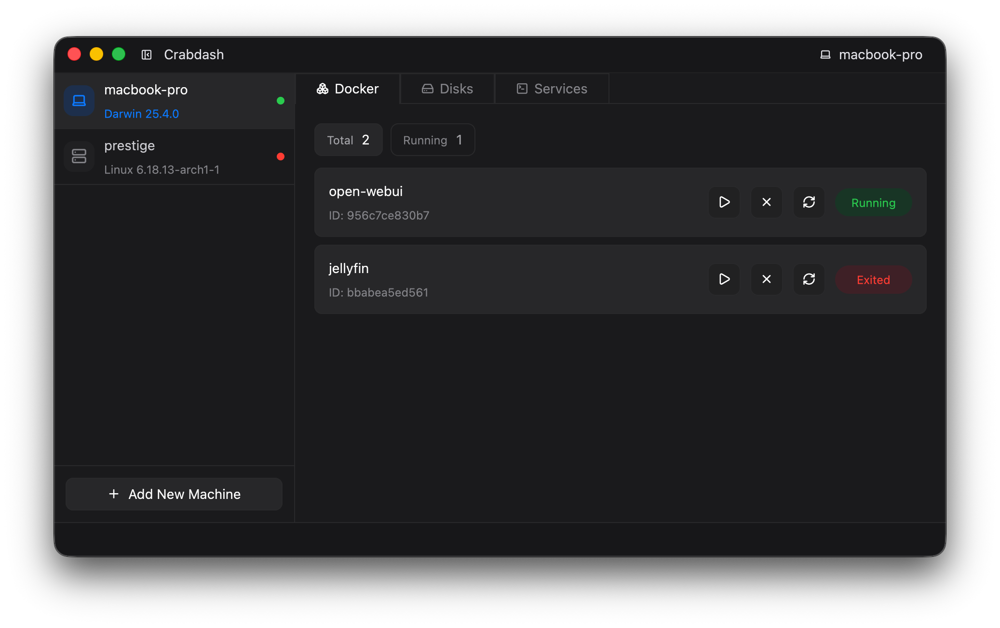

# Crabdash

> [!NOTE]
> This project is under active development and features may change as the project evolves toward v0.2.0



Crabdash is a native desktop dashboard for managing machines and services (such as homelabs).

It provides a single interface for inspecting and controlling:

- local system services
- Docker containers
- disks and mounts
- remote Linux machines over SSH

The goal is to replace scattered terminal commands with a focused control panel while still allowing quick fallbacks to the terminal when needed.

Crabdash is built as a native desktop application using **Rust** and **[GPUI](https://www.gpui.rs/)** — the same GPU-accelerated UI framework that powers the [Zed](https://zed.dev) code editor.

## Architecture

The project is organised as a Rust workspace with four crates, each with a distinct responsibility:

- `crabdash` — entry point and application lifecycle
- `app` — UI layer built on GPUI
- `machines` — machine management, SSH connections, and remote state
- `services` — service integrations (Docker, systemd, disk inspection)

This separation keeps the UI decoupled from machine and service logic, making each layer independently testable and easier to extend. Strict workspace-wide linting is enforced — every fallible operation is explicitly handled rather than assumed to succeed.

## Features (Milestone v0.2.0)

- [x] System overview (hostname, OS version, architecture)
- [x] Docker container control (start, stop, restart)
- [x] Remote machine support via SSH (keyless, SSH key, and Tailscale)
- [x] Disk and mount inspection
- [x] System keychain integration for credential storage
- [ ] System health and stats
- [ ] System service management (`systemd`)
- [ ] Docker inspect and logs
- [ ] Quick command execution and logs

## Run

```bash
cargo run
```

## Build Dependencies

The project is based on GPUI and therefore largely depends on the same build dependencies as Zed.

Check out their documentation to get started: [Building Zed](https://zed.dev/docs/development/)

## Motivation

Crabdash started as a tool for managing my own homelab machines and containers without constantly jumping between SSH sessions, terminal commands, and the desktop environment on-device. The existing tools were either too heavyweight, web-based, or required running a separate server. Crabdash is a native binary that runs on your machine and talks directly to your infrastructure.
