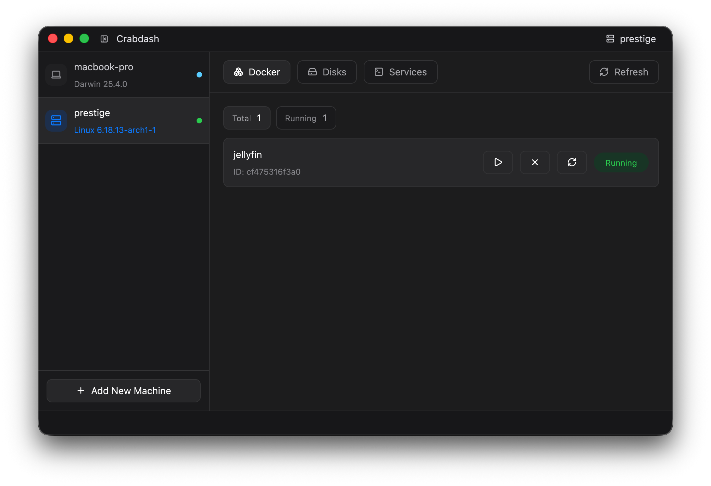

# Crabdash

> [!NOTE]
> This project is under active development and features may change as the project evolves toward v0.1.1.



Crabdash is a native desktop dashboard for managing machines and services (such as homelabs).

It provides a single interface for inspecting and controlling:

- local system services
- Docker containers
- disks and mounts
- remote Linux machines over SSH

The goal is to replace scattered terminal commands with a focused control panel while still allowing quick fallbacks to the terminal when needed.

Crabdash is built as a native desktop application using **Rust** and **[GPUI](https://www.gpui.rs/)**.

The project is organised as a Rust workspace separating UI, machine management, and service integrations.

## Features (Milestone v0.1.1)

- [x] System overview (hostname, OS version, architecture)
- [x] Docker container control
- [ ] System health and stats
- [ ] Disk and mount inspection
- [ ] System service management (`systemd`)
- [ ] Docker inspect and logs
- [ ] Remote machine support via SSH
- [ ] Quick command execution and logs

## Run

```bash
cargo run
```

## Build Dependencies

The project is based on GPUI and therefore largely depends on the same build dependencies as Zed. 

Check out their documentation to get started: [Building Zed](https://zed.dev/docs/development/)

## Motivation

Crabdash started as a tool for managing my own homelab machines and containers without constantly jumping between SSH sessions, terminal commands, and the Desktop Environment on-device.
