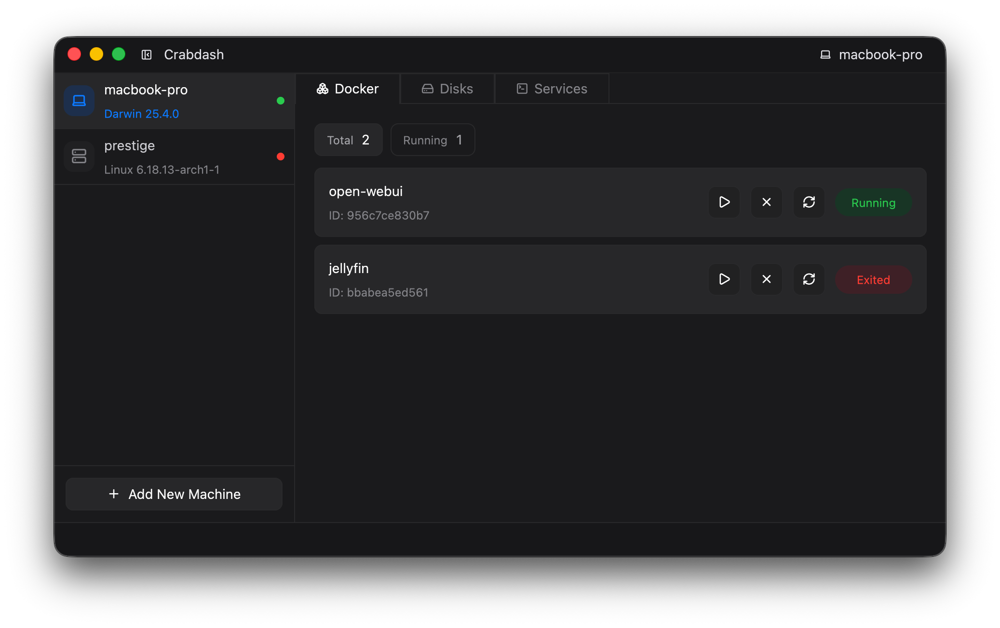

# Crabdash

> [!NOTE]
> This project is under active development and features may change as the project evolves toward v0.2.0



Crabdash is a native desktop dashboard for managing machines and services (such as homelabs).

It provides a single interface for inspecting and controlling:

- local system services
- Docker containers
- disks and mounts
- remote Linux machines over SSH

The goal is to replace scattered terminal commands with a focused control panel while still allowing quick fallbacks to the terminal when needed.

Crabdash is built as a native desktop application using **Rust** and **[GPUI](https://www.gpui.rs/)** — the same GPU-accelerated UI framework that powers the [Zed](https://zed.dev) code editor.

## Architecture

The workspace has five crates:

- `crabdash`: executable entry point and logging setup.
- `app`: GPUI application composition, feature controllers/views, and local desktop integration.
- `machines`: machine identity, local/SSH transport, and domain-specific operations on the selected machine.
- `services`: platform-neutral Docker and system-service contracts and actions.
- `utils`: shared data models, arguments, raw command output, and domain parsers.

Inside `app`, `features/` declares Docker, disks, system services, shared logs, machines, terminals,
preferences, and notifications. Each feature owns its controller, view/editor, and
feature-specific types, including table filtering and ordering in `table.rs`. `components/` contains reusable UI primitives; `content/`
only composes the main panels and navigation. `app.rs` owns the root entity and
connects these modules, and `desktop/runtime.rs` owns application lifecycle.

Local desktop features live in `app/src/desktop/{about,menus,startup,tray,window}/`.
Each declares adjacent `linux.rs` and `macos.rs` implementations behind a common
interface. Platform selection stays at the module boundary. macOS uses native
AppKit menus, window controls, and its About panel; Linux uses the GPUI menu bar,
client window controls, systemd login service, and StatusNotifier tray. Unavailable
startup/tray capabilities are explicit in the macOS backends.

Selected-machine operations live in `machines/src/{docker,disks,services,terminal}`.
Disk and system-service modules dispatch to sibling Linux/macOS backends using the
**selected machine's platform**, so both backends are compiled on either host for
SSH management. Terminal sessions share one API with `local.rs` (portable PTY on
both hosts) and `ssh.rs` transports. Corresponding output parsers live in
`utils/src/{disks,services}/{linux,macos}.rs`; raw `Output` has no domain parsing.

GPUI is pinned to 0.2.2 with a local text-measurement patch in `vendor/gpui`.
Each truncation measurement starts from the original UTF-8 text runs, preventing
Unicode sidebar/table labels from aborting on macOS during flex remeasurement.
See `vendor/gpui/CRABDASH_PATCHES.md` for the patch and native regression checks.

When adding a feature, declare its module, keep domain work out of the shell and
reusable components, and put platform implementations next to each other with
matching interfaces. Use host `cfg` only for local desktop integration; use runtime
machine-platform dispatch for remote operations. Preferences and saved machine
formats are independent of this source layout.

Machine identity discovery lives in `machines/src/system_info/`, with adjacent
Linux/macOS backends selected by the machine's platform. Linux reads `os-release`
over the existing local/SSH transport. Distro logos and display labels live in
`app/src/features/machines/logos.rs`; their attributed SVGs are embedded from
`app/assets/machine-logos/` and work offline in installed builds. Unknown Linux
distributions use Tux, and saved machines without distro metadata migrate on refresh.

## Features (Milestone v0.2.0)

- [x] System overview (hostname, OS version, architecture)
- [x] Docker container control (start, stop, restart)
- [x] Remote machine support via SSH (keyless, SSH key, and Tailscale)
- [x] Disk and mount inspection
- [x] System keychain integration for credential storage
- [ ] System health and stats
- [ ] System service management (`systemd`)
- [ ] Docker inspect and logs
- [ ] Quick command execution and logs

## Run

```bash
cargo run
```

## Build Dependencies

The project is based on GPUI and therefore largely depends on the same build dependencies as Zed.

Check out their documentation to get started: [Building Zed](https://zed.dev/docs/development/)

On Fedora, install Rust, Zig, and the native build dependencies:

```bash
sudo dnf install rust cargo zig gcc gcc-c++ clang cmake make pkgconf-pkg-config \
  alsa-lib-devel fontconfig-devel glib2-devel libva-devel wayland-devel \
  libxcb-devel libxkbcommon-x11-devel openssl-devel libzstd-devel \
  vulkan-loader mesa-vulkan-drivers sqlite-devel \
  perl-FindBin perl-IPC-Cmd perl-File-Compare perl-File-Copy git
cargo build --locked
```

Linux windows include GPUI title-bar controls. Hold Alt to show the application
menus and their underlined access keys in the same bar; Alt+C/F/E/V/W/H opens a
menu directly. The menus remain visible while a menu is open, and include
shortcuts for editing actions even when no text field is focused. Hold Alt to
reveal tab shortcuts. The icon-only Terminal button keeps its shortcut in the
tooltip and stays anchored beside the window controls. Ctrl+1/2/3
selects Docker/Disks/Services; Ctrl+Shift+M maximizes or restores the window. Use
Ctrl+N to add a machine, Ctrl+R to refresh, Ctrl+J for the terminal, F10 for the
menus, and F11 for full screen. Error notifications stay visible until dismissed
or cleared by a successful action, including across background refreshes.

On Linux, **Crabdash → Preferences → General → Start at login** enables the local
`crabdash.service` systemd user unit under `$XDG_CONFIG_HOME/systemd/user` (or
`~/.config/systemd/user`). It opens the installed executable at the next graphical
login and exits with the desktop session. Disabling the preference removes the
login registration without closing an already running window. Install the binary
at a stable path before enabling the preference; it does not affect remote machines.

**Start minimised** launches Crabdash in the background, including when started
by the login service. This preference is saved in
`$XDG_CONFIG_HOME/crabdash/preferences.json` (or `~/.config/crabdash/preferences.json`).
The Linux tray icon opens the existing window and offers **Show Crabdash** and
**Quit**. Closing a window keeps its sessions running when a tray is available;
use Quit to exit. Without tray support, closing the last window exits normally.

Preferences has **General**, **Terminal**, and **Interface** sections:

- General: login/background behavior, automatic refresh, refresh interval, and recent log limits.
- Terminal: installed monospaced font, font size, line height, TERM/terminfo, true-colour advertisement, scrollback buffer, and initial panel rows. Font changes update existing terminals and log views; environment and buffer settings affect new sessions.
- Interface: system or installed font, font size, sidebar width, equal tab widths, and persistent shortcut hints. Controls scale with the interface font size.

Docker, disk, and service tables share rounded cards, neutral controls and consistent labels,
status filters, and a live search field. Click a data-column heading to sort;
click it again to reverse the order. Changing a filter, search, or sort returns
the list to the top. Filters and sorting survive refreshes within the session.
Disk searches include partition names and mount paths while retaining the parent
device tree. Inactive or stopped items use neutral status labels; failures use red.

Container and service logs share an inline viewer on the same surface as their
table rows, with consistent spacing, a recent-log header, line count, and Copy
logs control. Log text respects terminal font settings and ANSI colours, and
long output scrolls in both directions inside a bounded panel.

Use **Apply** to save, **Cancel** to discard edits, or **Restore defaults** to prepare the default settings. Start at login is saved immediately. Preferences use the JSON path above on Linux and `~/Library/Application Support/Crabdash/preferences.json` on macOS. Old startup-only preferences gain defaults automatically. Errors remain visible until dismissed.

The compatibility default is `TERM=xterm-256color` with the bundled JetBrains Mono font. The terminal-type chooser also offers `xterm` and `vt100` for older hosts, and `xterm-ghostty` for hosts with Ghostty's terminfo installed. The selected TERM is sent to both local and SSH pseudo-terminals; Crabdash does not install terminfo on remote machines. See [Ghostty's terminfo guidance](https://ghostty.org/docs/help/terminfo).

The terminal follows new output at the live prompt. Scroll up with the mouse or
Shift+Page Up to read history without new output moving your view. Shift+Page Down
scrolls forward; Ctrl+Shift+Home/End jumps to the beginning/latest output. Click
**Latest output** or type to return to the live prompt. Cursor keys respect terminal
application mode, and paste respects bracketed-paste mode. While the terminal has
focus, shell editing keys such as Ctrl+A, Ctrl+E, Ctrl+U, and Ctrl+W go to the shell.

GNOME requires AppIndicator support to display tray icons. On Fedora, install
`gnome-shell-extension-appindicator` and enable
`appindicatorsupport@rgcjonas.gmail.com` with `gnome-extensions enable`. If the
extension was newly installed, a new desktop login may be needed to load it.

## Motivation

Crabdash started as a tool for managing my own homelab machines and containers without constantly jumping between SSH sessions, terminal commands, and the desktop environment on-device. The existing tools were either too heavyweight, web-based, or required running a separate server. Crabdash is a native binary that runs on your machine and talks directly to your infrastructure.

Docker container controls include Start, Stop, Restart, Pause/Resume, logs and
Remove, with Total/Running/Paused/Stopped filters. Run remains available with an
empty list. Removal asks for confirmation, stops active containers gracefully,
and keeps images, volumes and bind-mounted files. Force removal is an explicit
option. Pending actions are tracked separately for each machine.

Run uses compact Container, Network & storage, Environment, and Advanced tabs,
with a collapsible command preview. Its neutral actions match the table controls.
Run creates detached containers, with optional open stdin. The preview quotes
individual arguments; the command field supports shell-style quoting without
shell expansion. Invalid resource limits and conflicting options are rejected
before submission. Docker errors remain in the modal and preserve the form for
retry. Parameter validation lives in `features/docker/run_parameters.rs`, form
state in `run.rs`, presentation in `run_modal.rs`, and CLI dispatch in
`machines/src/docker.rs`; local and SSH machines use the same arguments.
